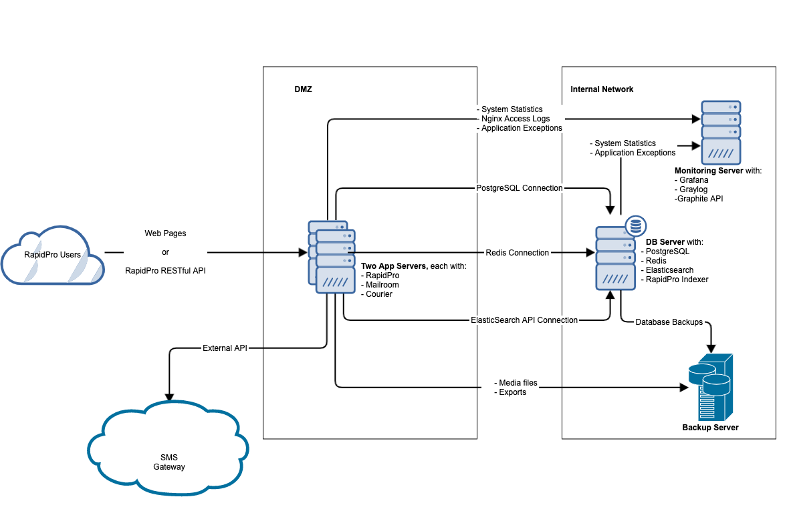

# RapidPro Load Balanced Setup

This example demonstrates how to setup RapidPro on two load balanced servers that share a database server (PostgreSQL, Redis, and Elasticsearch) and a monitoring server ( Grafana, Graylog, Graphite API)

This directory contains Ansible playbooks to deploy services against four Ubuntu 20.04 VirtualBox virtual machines (also set up using files here).

Here is an architecture diagram of the setup


## Load-balanced setup architecture
1.  RapidPro app servers: Each of the two application servers run
    - RapidPro Django application
    - Mailroom
    - Courier
    - Nginx
2. Database server: 1 shared database server running
   - PostgreSQL
   - Redis
   - ElasticSearch
   - RapidPro Indexer
3. Monitoring server: 1 shared monitoring server running
   - Graylog
   - Graphite API
   - Influxdb
   - Grafana

## What you will need to run the example

1. A Linux or MacOS Machine running Ansible 2.10 and up.
2. Vagrant and Virtualbox installed on your machine. The machine should have 10 GB of free memory for the setup to run flawlessly. If you don't have that amount of free memory, try amend the allocated memory for the vagrant machines [here](load-balanced/vagrant/hosts/).
3. An SSH key that Ansible will use to connect to the hosts. You can generate one by running `ssh-keygen -t ed25519 -f ~/.ssh/id_ed25519`

# Step by Step fresh setup of RapidPro

1. Clone this project
2. Bring up the virtual machines
3. Initial load-balanced Server Setup
4. Deployment Environment Setup
5. Create inventories from template
6. Edit the inventories/[environment] variables to match your deployment
7. Generate SSL certificates for PostgreSQL communication
8. Generate PostgreSQL backup GPG keys
9. Copy SSL certificates
10. Deploy the services

#### 1. Clone this project

Get the latest playbooks to start with.

```sh
git clone --recurse-submodule https://github.com/onaio/ansible-collection-rapidpro.git
cd ansible-collection-rapidpro/examples/load-balanced
```

#### 2. Bring up the virtual machines
You will first need to bring up the VirtualBox virtual machines using Vagrant. Do this by running: `./bring-up.sh`

Alternatively run `vagrant up` while in the vagrant directory

#### 3. Initial load-balanced Server Setup

Install Ubuntu Server 18.04 in four servers. See purpose of servers
in the architecture above.

#### 4. Deployment Environment Setup

Install Ansible 2.10+ in a python 3 environment.

```sh
# Install virtualenv
pip install --user virtualenv

# Ensure ~/.local/bin is in your environment
export PATH=~/.local/bin:$PATH

# Create a Python 3 virtual environment
mkdir -p ~/.virtualenvs
virtualenv -p python3 ~/.virtualenvs/rapidpro
source ~/.virtualenvs/rapidpro/bin/activate

# Install Pip Dependencies
pip install -r requirements/base.pip
```

Ensure you have the latest ansible roles installed. Include `-f` option to
reinstall and force for an update of the roles.

```sh
ansible-galaxy install -r requirements/ansible-galaxy.yml -p roles [-f]
```

#### 5. Create inventories from template

Copy the inventory directory into an inventories/[environment]. It is possible
to use the same playbooks for multiple environments.

```sh
mkdir -p inventories
cp -r inventory inventories/[environment]
```

#### 6. Edit the inventories/[environment] variables to match your details

Edit inventories/[environment]/group_vars/all/vars.yml and set the correct values for

```
deployment_owner
rapidpro_setup_type
rapidpro_admin_email
rapidpro_postgresql_password
rapidpro_email
```

#### 7. Generate SSL certificates for PostgreSQL communication

You can find more information on how to generate the SSL certificates in this collection's [README.md#postgresql-tls](../../README.md#postgresql-tls)
We strongly encourage encrypting secrets using a tool like Ansible Vault.
Set the values in your environment for these values
```
rapidpro_postgresql_ssl_domain
rapidpro_postgresql_ssl_ca_key
rapidpro_postgresql_ssl_ca_cert
```
#### 8. Generate PostgreSQL backup GPG keys

You can find more information on how to generate the SSL certificates in this collection's [guide on GPG](../../docs/generating-gpg-key.md), and update the values in
inventories/[environment]/group_vars/rapidpro_postgresql/vars.yml including

```
rapidpro_backup_gpg_key_id
rapidpro_backup_gpg_private_key
rapidpro_backup_gpg_public_key
rapidpro_backup_gpg_trust_file
rapidpro_backup_gpg_pass
```
### 9. Copy SSL certificates
Generate SSL certificates for your domain and place the certificate and key files in a directory inside your working directory. Set the variables below to match the path of the certificates you copied
```
rapidpro_ssl_cert
rapidpro_ssl_key
rapidpro_ssl_cert_directory
```
For this example, we are using a self-signed certificate generated by running `openssl req -newkey rsa:2048 -nodes -keyout key.pem -x509 -days 365 -out files/ssl/certificate.pem`

Refer to this collection's [README.md](../../README.md) for details on what these variables set, and possible values.

#### 10. Deploy the services

Deploy all services all at once or one by one.

```sh
ansible-playbook -i inventories/[environment] collections/ansible_collections/onaio/rapidpro/playbooks/deploy-all.yml
```

When deploying servers one by one the order of deployment is:

i. initial-setup: Prepares the hosts with the right security, monitoring and tools needed by other Ansible roles

```sh
ansible-playbook -i inventories/[environment] collections/ansible_collections/onaio/rapidpro/playbooks/initial-setup.yml
```
You can also re-run the playbook and target a specific host. This could be useful in case of a failure such as dpkg lock due to a concurrent system
update.
```sh
ansible-playbook -i inventories/[environment] collections/ansible_collections/onaio/rapidpro/playbooks/initial-setup.yml --limit <name of host or address such as database_host or 10.0.0.5>
```
ii. PostgreSQL: you may need to run it a second time if it fails the first time.

```sh
ansible-playbook -i inventories/[environment] collections/ansible_collections/onaio/rapidpro/playbooks/postgresql.yml
```

iii. Redis

```sh
ansible-playbook -i inventories/[environment] collections/ansible_collections/onaio/rapidpro/playbooks/redis.yml
```

iv. Elasticsearch

```sh
ansible-playbook -i inventories/[environment] collections/ansible_collections/onaio/rapidpro/playbooks/elasticsearch.yml
```

v. RapidPro App

```sh
ansible-playbook -i inventories/[environment] collections/ansible_collections/onaio/rapidpro/playbooks/rapidpro-app.yml
```
## Monitoring

- Add the [monitoring collection](https://github.com/onaio/ansible-collection-monitoring/) as a git submodule.
  ```sh
  git submodule add https://github.com/onaio/ansible-collection-monitoring.git collections/ansible_collections/onaio/monitoring
  ```
- Install Ansible Galaxy requirements
  ```sh
  ansible-galaxy role install -r collections/ansible_collections/onaio/monitoring/requirements/ansible-galaxy.yml -p roles
  ```
- Update your inventories to include all the variables listed in the [collection's documentation](https://github.com/onaio/ansible-collection-monitoring/#using-the-collection)
- Run the monitoring playbook
  ```sh
  ansible-playbook -i iinventories/[environment] deploy-monitoring.yml
  ```
